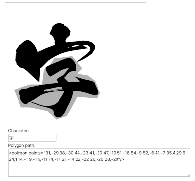
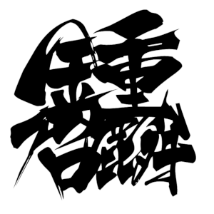
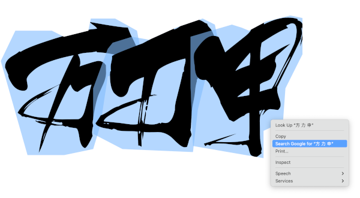
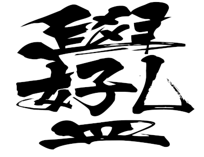
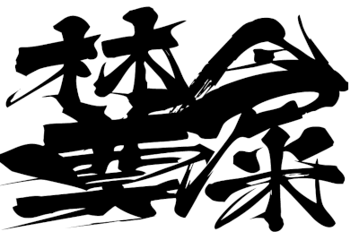

# Combined Chinese Character (合體字) Design

- Tool to design the clip path
    - Demo: [https://hkpeterpeter.github.io/combined_chinese_character/tool_generate_clip_polygon.html](https://hkpeterpeter.github.io/combined_chinese_character/tool_generate_clip_polygon.html)
    - Use mouse click to define the polygon path
    - Use mouse double-click to end the polygon path
    - The clip path will be copied to another HTML/SVG document to design the combined Chinese character

## Demo: 鍾啟麟

Demo: [https://hkpeterpeter.github.io/combined_chinese_character/my_chinese_name.html](https://hkpeterpeter.github.io/combined_chinese_character/my_chinese_name.html)

- Put my surname (鍾) at the top
- Put my other names (啓麟) at the bottom
- Clip the overlapping parts of the other names to emphasize my surname
- Arrange the characters like a square

## Demo: 方力申

### This example illustrates how this technique is different from drawing a pure vector Graphics

Demo: [https://hkpeterpeter.github.io/combined_chinese_character/beheaded_fong.html](https://hkpeterpeter.github.io/combined_chinese_character/beheaded_fong.html)
- Select all 3 Chinese characters 
- Right-click in Chrome

## Demo: 學好孔孟

Demo: [https://hkpeterpeter.github.io/combined_chinese_character/learn_confucianism_great.html](https://hkpeterpeter.github.io/combined_chinese_character/learn_confucianism_great.html)

## Demo: 林鄭食屎

Demo: [https://hkpeterpeter.github.io/combined_chinese_character/lam_cheng_eat_shit.html](https://hkpeterpeter.github.io/combined_chinese_character/lam_cheng_eat_shit.html)

相關新聞: YouTube 突擊封區　馬鞍山居民：林鄭食屎啦: [https://www.youtube.com/watch?v=CVq-9nCNOSI](https://www.youtube.com/watch?v=CVq-9nCNOSI)

 
